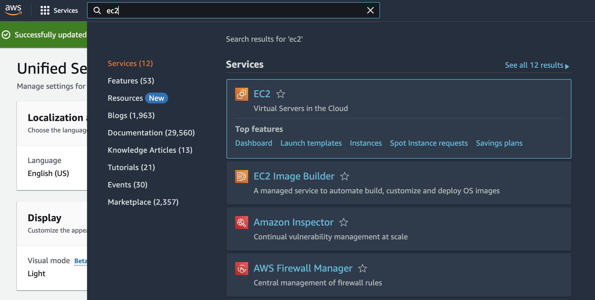
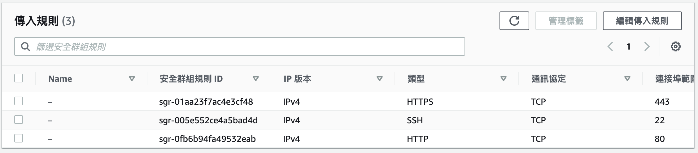
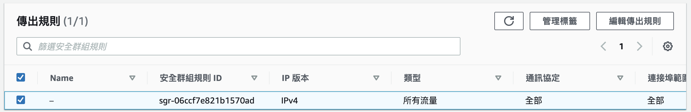

## 說明
AWS EC2設置：帳號建立、IAM設置、Security group 設定 \
EC2網頁環境建置：Python環境建置、nginx環境建置、域名、SSL憑證取得、部署 \
Github檔案紀錄存放：帳號申請、安裝、上傳、markdown 
## AWS EC2設置
1. 帳號建立
* 至AWS申請帳號，期間會需要手機以及信用卡驗證
* 申請成功後登入帳號，並點選在頁面右上方選擇Security credentials，
找到Multi-factor authentication (MFA)，選擇Assign MFA device手機或任何行動裝置下載Authy或者其他軟體以進行綁定。
* 之後登入會需要這個驗證有六碼數字[1]

1-0 請先確定右上角的區域是離你最近的區域
1-1 申請完後上方搜尋欄搜尋EC2，選擇後點選Launch instance

1-2 進入頁面後選擇AMi

1-3 instance type選擇t2.micro
1-4 Key Pair方面建立一個Key pari (Create new key pair)
1-5 Network Setting 中按照下圖設定

1-6 Advanced detail找到IAM instance profile點選右邊Create new IAM profile \

選擇Create role，選AWS Service及EC2，搜尋並增加"AmazonEC2FullAccess"以及"AmazonSSMManagedInstanceCore" \
結束後回至EC2匯入
1-7 點選右側Launch instance
1-8 點選啟動的EC2，選擇connect，選擇Session Manager，點選connect

2. IAM設置
2-1.IAM的設置

首先，最重要的是設定MFA[1]！
請至IAM中先在右邊欄位選取Users後再選擇Security credentials，並點選Assign MFA device，手機或任何行動裝置下載Authy或者其他軟體以進行綁定。

* 這邊是練習如何設置最低權限，如果沒有要練習的話可以直接在設定完MFA之後加入admin就好！直接跳到下方EC2網頁環境設置

在IAM設置時需要設定三個東西，設定的細節我將附在文末參考資料後方。
2-2. 可以參考這份資料[3]，在這之後會依最低限度建立只能使用EC2的IAM角色。關於EC2的設定如(1)所示

2-3. 在設置完後測試後使用IAM登入時會如果有跑出如圖2的錯誤訊息，那麼需要在IAM policy中加入ComputeOptimizerReadOnlyAccess

2-4.最後需要加入AmazonSSMAutomationRole，由於目標的是最低限度的開放，因此有過濾不需要的權限，這邊可參考下方(2)所提供的資訊，此外可以透過在instance中設定tag來限制只能存取哪些instance，這邊的設定Key:Value為Team:Alpha。需要在Root新增tag後才可以使用。

如果選擇使用AmazonSSMAutomationRole會產生錯誤訊息，會需要在Action加入 "ec2:DescribeInstanceStatus"。

2-5.EC2 security group設定
由於需要限制只能由IAM user登入，此外如果沒有請求的需要的話，建議關閉所有port，當中包含port22，這樣就不能由原本的ssh登入，只能由IAM進入系統。

最後
設定完後可以由EC2的頁面中選擇“連線”並選擇“Session Manager”進行連線

3. Security group 設定
Security group設定建議如下圖所示：

## EC2網頁環境建置
* 環境選擇：網頁環境可以有很多種選擇：語言可以有Java、Python，部署可以有Apache、Nginx、Tomcat

1. Python環境建置：

2. nginx環境建置：

3. 域名：
可至gandi、Amazon Route53購買
可以透過A指向public IP

5. SSL憑證取得
6. 部署

## Github檔案紀錄存放
1. github帳號申請
2. github安裝
3. 上傳github教學
4. markdown

## 最後更新日期 2023/5/12
## 參考資料
[1]【Git】使用MacOS 作業系統安裝 Git - 以 Homebrew 網頁安裝 \
https://ithelp.ithome.com.tw/m/articles/10263551

[2]使用 AWS 中的多重要素驗證
https://docs.aws.amazon.com/zh_tw/IAM/latest/UserGuide/id_credentials_mfa.html

[3]AmazonEC2FullAccess
https://docs.aws.amazon.com/zh_tw/aws-managed-policy/latest/reference/AmazonEC2FullAccess.html

